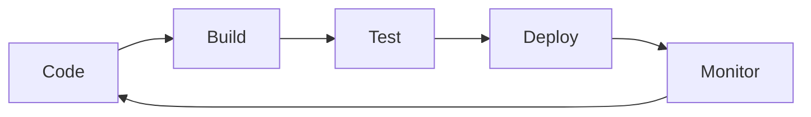

<div align="center">
  
</div>

<div align="center">
  
  <a href="https://github.com/valentin-todorov?tab=followers">
    
  </a>
</div>

---

### 🚀 About Me

```yaml
name: Valentin Todorov
location: Sofia, Bulgaria
current_role: Cloud Platform Engineer @ FLYR
specialties: [DevOps, Cloud Architecture, Infrastructure as Code]

daily_stack:
  languages: [Python, Go, Bash, YAML]
  cloud: [Azure, GCP, AWS]
  iac: [Terraform, Helm, Kustomize]
  containers: [Docker, Kubernetes, containerd]
  ci_cd: [CircleCI, GitHub Actions, ArgoCD, GitOps]
  monitoring: [Prometheus, Grafana, DataDog]
  
interests: ["Calisthenics 💪", "All Sports 🏃‍♂️", "Cloud Native Tech ☁️"]
```

---

### 🛠️ Tech Stack

<div align="center">

#### Cloud & Infrastructure


#### Container & Orchestration


#### IaC & Configuration


#### CI/CD & GitOps


#### Languages


#### Monitoring & Observability


</div>

---

### 📊 GitHub Analytics

<div align="center">
  
  
</div>

<div align="center">
  
</div>

---

### 🏆 GitHub Trophies

<div align="center">
  
</div>

---

### 💡 DevOps Philosophy

<div align="center">
<table>
<tr>
<td width="50%">



</td>
<td width="50%">

**Core Principles:**
- 🔄 **Automate Everything**
- 🔒 **Security First**
- 📈 **Continuous Improvement**
- 🤝 **Collaboration**

</td>
</tr>
</table>
</div>

---

### 📈 Contribution Graph

<div align="center">
  
</div>

---

### 🌱 Current Focus

- 🔭 Building scalable cloud infrastructure at **FLYR**
- 🌱 Deep diving into **Platform Engineering** and **Developer Experience**
- 👯 Contributing to open-source **DevOps** and **Cloud Native** projects
- 💬 Ask me about **Kubernetes**, **Terraform**, **CI/CD pipelines**, or **Cloud Architecture**
- ⚡ Fun fact: When I'm not deploying containers, you'll find me doing calisthenics or exploring new sports!

---

### 🤝 Let's Connect!

<div align="center">
  
[](https://linkedin.com/in/valentin-todorov)
[](https://github.com/valentin-todorov)
[](mailto:your.email@example.com)

</div>

---

<div align="center">
  
</div>

<div align="center">
  <b>Building the cloud infrastructure of tomorrow, one deployment at a time 🚀</b>
</div>
